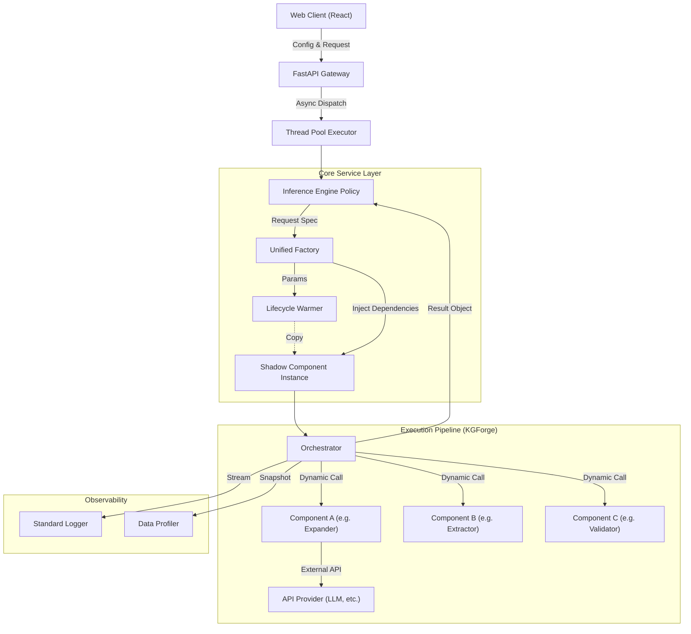

# KONG Server 架构文档

本文档描述了 **KONG (Knowledge Oriented Neo-Graph)** 后端 Python 服务的整体架构。该服务采用 **Metadata-Driven（元数据驱动）** 和 **Event-Loop Optimized（事件循环优化）** 的设计哲学，旨在高效、并发地支撑复杂的大模型动态推理任务。

## 1. 核心设计图 (High-Level Architecture)

## 2. 关键组件解析

### 2.1 API 网关 (FastAPI Gateway)
*   **位置**: `server/python/python_service/api/routes.py`
*   **职责**:
    *   接收前端的 JSON 请求（包含 Goal, Text, Components 配置）。
    *   **并发优化**: 使用 `run_in_threadpool` 将计算密集型的推理任务剥离出 FastAPI 的主 Event Loop，防止阻塞其他轻量级请求（如心跳检测、配置拉取）。
*   **输入**: `InferenceRequest` (Goal, Text, Component Specs, API Key)
*   **输出**: 标准化的 JSON 结果（包含 Graph, Metrics, Trace）。

### 2.2 推理引擎 (Inference Engine)
*   **位置**: `server/python/python_service/services/inference.py`
*   **职责**:
    *   **上下文组装**: 解析请求中的扁平化参数（`components`, `component_params`），将其结构化为工厂可识别的配置树。
    *   **全量透传**: 它本身不执行业务逻辑，而是将编排器产生的 `ExperimentResult` 对象完整映射为字典返回给前端。这种设计实现了后端对具体业务逻辑的“无知性 (Ignorance)”，大大增加了系统的灵活性。

### 2.3 统一工厂 (Unified Factory)
*   **位置**: `server/python/python_service/core/factory.py`
*   **职责**: **组装流水线**。这是整个架构中最复杂的部分。
    1.  **影子实例 (Shadow Instances)**: 为了支持高并发，工厂不再直接修改缓存的单例组件。当请求带有自定义参数（如 API Key, Temperature）时，工厂会 `copy.copy()` 一个基础实例，并只从修改这个“影子”，从而保证不同请求间的状态隔离。
    2.  **递归依赖注入 (Recursive Slot Injection)**: 根据组件的 `ComponentSpec`，自动查找所需的子组件接口，并递归调用工厂创建子组件（例如：Orchestrator 需要一个 Expander，工厂会自动根据配置创建指定的 Expander 并注入）。

### 2.4 组件生命周期 (Lifecycle Warmer)
*   **位置**: `server/python/python_service/services/lifecycle.py`
*   **职责**:
    *   **自省 (Introspection)**: 启动时扫描所有代码目录，识别出所有的 `Expander`, `Extractor`, `Orchestrator` 类。
    *   **预热 (Warm-up)**: 提前实例化无状态组件，放入缓存池，减少首次请求的延迟。

## 3. 数据流 (Data Flow)

1.  **配置阶段**: 前端 UI 通过 `/models/catalog` 拉取所有可用组件及其参数 Schema。
2.  **请求阶段**: 用户点击 "Start"，前端发送一个包含所有选定组件 ID 和具体参数的 JSON。
3.  **实例化阶段**:
    *   Factory 接收请求。
    *   它发现用户选择了 `GPT-Expander` 并设置了 `temp=0.7`。
    *   它从缓存取出 `GPT-Expander` 原型，复制一份（影子）。
    *   它将 `temp=0.7` 应用到影子实例上。
4.  **执行阶段**:
    *   Orchestrator 开始运行。
    *   它调用注入进来的 `Expander`（即刚才那个影子）。
    *   `Expander` 使用用户提供的 API Key 调用 LLM。
    *   过程产生的数据（Log, Trace）被记录。
5.  **响应阶段**: 最终的图结构和过程指标被打包返回。

## 4. 扩展性设计 (Extensibility)

本架构支持**代码即插即用**。要添加一个新的算法（例如新的 `LlamaExtractor`）：
1.  **无需修改 Server 代码**：只需在 `core/kgforge/components/extractors` 下新建一个 Py 文件。
2.  **继承基类**：继承 `BaseExtractor` 并实现 `extract` 方法。
3.  **重启服务**：`Lifecycle Warmer` 会自动发现新类，`Unified Factory` 会自动将其注册到目录，前端会自动渲染它的选项。
