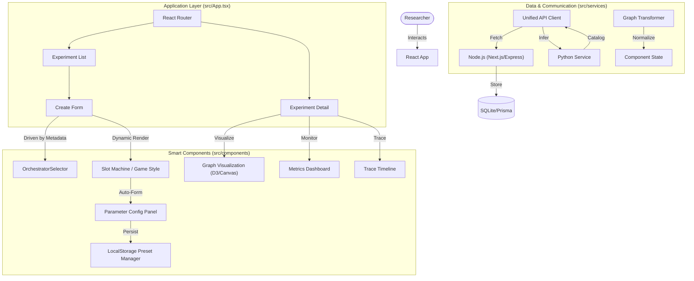

# KONG Web Architecture (Frontend)

本文档描述了 **KONG Web UI** (React/TSX) 的架构设计。作为一个**元数据驱动 (Metadata-Driven)** 的科研控制台，它具有高度的动态性和可配置性，能够根据后端返回的组件规范自动渲染复杂的控制界面，而无需硬编码。

## 1. 核心架构图 (High-Level Architecture)



## 2. 关键设计模式

### 2.1 元数据驱动 UI (Metadata-Driven UI)
这是前端最核心的设计模式。
*   **问题**：后端算法迭代极快，今天加一个参数 `temperature`，明天加一个 `threshold`，如果每次都要改前端代码，效率极低。
*   **方案**：后端通过 `/models/catalog` 接口返回一个 JSON Schema（定义了组件参数的类型、范围、默认值）。
    *   `src/components/ParameterConfigPanel.tsx` 接收这个 Schema，自动生成对应的 Slider、Toggle、Input 控件。
    *   **优势**：后端算法工程师只需要修改 Python 代码里的参数定义，前端 UI **自动更新**，实现了前后端开发的解耦。

### 2.2 插槽化组件选择 (Slot-Based Selection)
*   **逻辑**：`CreateExperimentForm` 不硬编码可选组件。
*   **实现**：
    1.  首先选择 **Orchestrator**。
    2.  根据 Orchestrator 的 `slots` 定义（例如需要 `IExtractor` 和 `IHalting`），动态渲染出对应的插槽。
    3.  `GameStyleSelector` 组件根据插槽接口类型，从 Catalog 中筛选出符合条件的组件供用户选择。
    *   **效果**：像装配游戏装备一样组装科研管线。

### 2.3 本地预设管理 (Local Preset Management)
*   **位置**: `src/components/ParameterConfigPanel.tsx` (Component Level) & `CreateExperimentForm.tsx` (Global Level)
*   **机制**:
    *   使用浏览器 `localStorage` 存储用户的参数配置组合。
    *   **Component Preset**: 针对特定算法组件（如 ReBel Extractor）的参数偏好。
    *   **Global Preset**: 针对整套实验配置（Orchestrator + All Components + Params）的快照。
    *   **目的**: 极大地加速了消融实验（Ablation Study）的配置过程，用户可以一键回填复杂的实验参数。

## 3. 数据流 (Data Flow)

1.  **初始化**: App 启动 -> 调用 `api.components.fetchCatalog()` -> 获取组件元数据 -> 存入 State。
2.  **配置实验**:
    *   用户选择 Orchestrator。
    *   UI 渲染 Slots。
    *   用户填充各个 Slot 的组件和参数（可从 Preset 加载）。
    *   点击 "Start Exploration"。
3.  **运行实验**:
    *   `api.experiments.create()` 将配置发送给 Node 后端持久化。
    *   Node 后端调用 Python `api.inference.run()`。
    *   Python 流式返回/异步返回结果。
4.  **可视化**:
    *   `ExperimentPage` 轮询/接收结果。
    *   `GraphVisualization` 将后端返回的 `Graph` 对象（Nodes/Edges）渲染为可视化图形。
    *   `IntermediateDataPanel` 展示中间过程数据。

## 4. 技术栈 (Tech Stack)

*   **Framework**: React 18 + Vite
*   **Language**: TypeScript
*   **State**: React Hooks (Context + LocalState)
*   **Styling**: Vanilla CSS + Inline Styles (for precise control) + Tailwind (Utility)
*   **Visualization**: (Assumed D3.js or similar library for GraphViz)
*   **API**: Native Fetch with Custom Interceptors (`apiClient.ts`)

## 5. 目录结构说明

```bash
web/src
├── components/          # 智能组件
│   ├── CreateExperimentForm.tsx  # 实验配置主入口
│   ├── GameStyleSelector.tsx     # 插槽选择器
│   ├── ParameterConfigPanel.tsx  # 动态参数面板（含 Preset）
│   └── GraphVisualization.tsx    # 图可视化
├── services/            # 数据层
│   ├── apiClient.ts     # 统一 API 客户端（处理 Node/Python 双后端）
│   └── graphTransformer.ts # 数据格式转换
├── types/               # 类型定义 (TypeScript Interfaces)
│   └── components.ts    # 核心元数据定义 (ComponentSpec, GraphNode...)
└── pages/               # 页面容器
    └── ExperimentPage.tsx # 实验详情页
```
