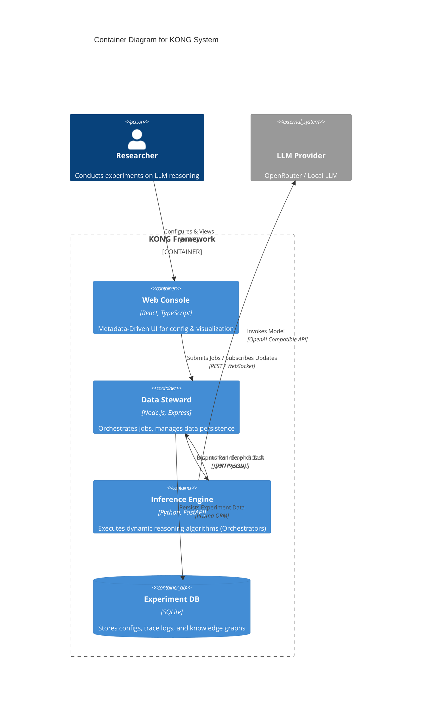
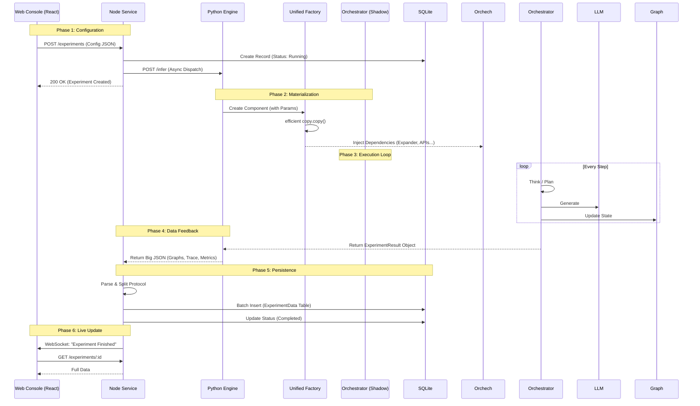

# KONG System Architecture (Research Grade)

**Knowledge Oriented Neo-Graph (KONG)** 是一个专为大语言模型 (LLM) 设计的科研级动态推理框架。本文档采用 **C4 Model** 的思想，通过分层视图详细阐述系统的架构设计。

## 1. 系统全景图 (L1: System Context)

这是一个宏观的视图，展示了 KONG 系统如何与外部世界（研究人员、LLM Provider）进行交互。

*(注意：系统架构图已生成并链接)*

---

## 2. 容器架构 (L2: Container Diagram)

本层展示了系统内部的**独立运行单元 (Containers)** 及其通信协议。这是一个分布式的微服务架构。

### 核心容器列表
1.  **Frontend (React SPA)**: 运行在浏览器中，提供动态 UI。
2.  **Node Middleware (Express)**: 运行在服务端，负责任务调度与数据持久化。
3.  **Python Engine (FastAPI)**: 运行在服务端，负责执行复杂的算法逻辑。
4.  **Database (SQLite)**: 存储所有实验数据。

---

## 3. 组件协同 (L3: Component & Interaction)

本层是**最详细**的逻辑视图，展示了当你点击 "Start" 后，系统内部发生的每一步细节。

### 3.1 跨语言交互流程 (The "Ignorance" Protocol)

关键设计：**Backend-Side Ignorance**。Python 端不关心业务数据的 Schema，它只产生一个巨大的 Result Object；Node 端也不关心这个 Object 里有什么，它只负责拆解和存储。这种松耦合使得新增算法功能无需修改中间层代码。

---

## 4. 关键技术决策 (Architectural Decisions)

| **决策点** | **方案** | **理由 (Why?)** |
| :--- | :--- | :--- |
| **前端交互** | **Metadata-Driven** | 为了适应科研场景下算法参数极高频的变更。后端改 Schema，前端自动渲染，无需发版。 |
| **并发模型** | **Shadow Instances** | 科研代码常写成单例 (Stateful Singleton)。为了并发安全，我们采用“原型模式”：运行时复制影子实例来隔离请求状态。 |
| **数据存储** | **SQLite + EAV** | 实验数据高度非结构化（Graph, Logs）。使用 SQLite 的文件便捷性 + EAV (Entity-Attribute-Value) 模式的灵活性，避免频繁变更表结构。 |
| **通信协议** | **REST + WebSocket** | REST 用于确定的 CRUD 操作，WebSocket 用于长时任务的状态推送，实现“伪实时”体验。 |

## 5. 目录结构导航

为了帮助开发者快速定位代码，以下是各层在项目中的物理映射：

*   **Frontend**: `web/src/` (React Components, Services)
*   **Middleware**: `server/node/src/` (Express Routes, Prisma Services)
*   **Backend**: `server/python/python_service/` (FastAPI, Factory)
*   **Kernel**: `core/kgforge/` (The actual algorithmic logic)
