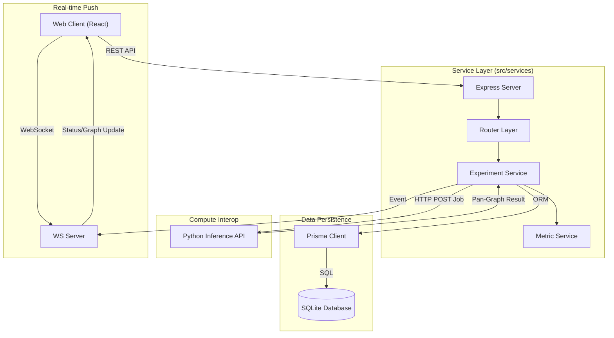

# KONG Server Architecture (Node.js)

本文档描述了 **KONG Node.js Service (Express)** 的架构设计。它在 KONG 生态系统中扮演着**持久层守门人**和**实时消息总线**的角色，有效地将 Python 服务的计算结果与 SQL 数据库解耦。

## 1. 核心架构图 (High-Level Architecture)



## 2. 核心职责

### 2.1 任务调度与代理 (Job Orchestration)
Node 服务不仅是一个简单的 CRUD 后端，更是一个轻量级的任务调度器。
*   **触发推理**: `ExperimentService.createExperiment` 不仅往数据库写一条记录，还负责调用 Python API 启动推理任务。
*   **Pan-Graph Protocol 解析**: Python 返回的 `ExperimentResult` 包含 Trace, Metrics, Logs, Graphs 等多种数据。Node 服务负责解析这一巨大的 JSON 包，并根据 `ExperimentData` 表的 Category 字段（metric, trace, graph）将其拆分存储。这种设计使得数据库结构无需频繁变动即可适应新类型的数据。

### 2.2 实时通信 (Real-Time Bus)
*   **Websocket**: `src/websocket/server.ts` 实现了一个简单的 Pub/Sub 系统。
*   **机制**: 当 Python 推理完成或失败，状态更新会立即通过 WS 推送给前端 `ExperimentPage`，无需前端轮询。**注意**：目前是大颗粒度的状态推送（Completed/Failed），未来的优化方向是支持流式（Streaming）推送推理的每一步。

### 2.3 数据持久化 (Persistence)
*   **工具**: Prisma ORM + SQLite。
*   **模型**:
    *   `Experiment`: 核心实验表 (ID, Name, Status, Config)。
    *   `Node`: 物理图节点表，用于快速查询和关系可视化。
    *   `ExperimentData` (通用桶): 存储一切“非结构化但有价值”的数据（如 Trace Logs, raw JSON graphs），采用 EAV (Entity-Attribute-Value) 模式的变体。

## 3. 关键数据流 (Data Flow - The Async Cycle)

1.  **Frontend**: POST `/api/experiments`
2.  **Node AP**I: 创建 `Experiment` 记录 (Status: running)。
3.  **Node Service**: 异步调用 Python `POST /infer` (此时 HTTP 请求对前端已返回)。
4.  **Python**: 执行耗时的推理 (可能持续 30s+)。
5.  **Node Service**:
    *   收到 Python 响应。
    *   解包 `intermediate_graphs`, `trace`, `metrics`。
    *   批量写入 `ExperimentData` 表。
    *   批量写入 `Node` 表。
    *   更新 `Experiment` 状态为 `completed`。
    *   通过 WebSocket 广播 `graph_update` 事件。
6.  **Frontend**: 收到 WS 消息，触发页面刷新。

## 4. 目录结构说明

```bash
server/node/src/
├── config/        # 环境变量与常量
├── routes/        # API 路由定义 (REST Interface)
├── services/      # 业务逻辑 (核心代码)
│   └── experiment_service.ts # 包含所有与 Python 交互和数据拆解的逻辑
├── websocket/     # 实时通信模块
└── utils/         # 基础设施 (Logger, ErrorHandler)
```

## 5. 扩展性 (Extensibility)

*   **新增数据类型**: 如果 Python 端返回了一个新的数据类型（例如 `audio_clips`），只需在 Python 端将其放入 `intermediate_stats` 或 `metadata`，Node 端的通用解析逻辑会自动将其作为 JSON 存入 `ExperimentData` 表，**无需修改 Node 代码**。
*   **切换数据库**: 得益于 Prisma，只需修改 `.env` 里的 `DATABASE_URL` 即可无缝切换到 PostgreSQL 或 MySQL。
