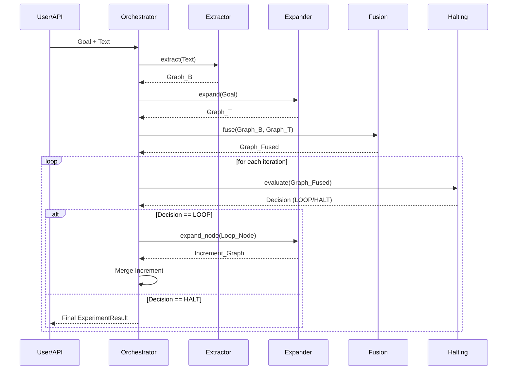

# KONG Architecture Deep-Dive

KONG implements a **Recursive Knowledge Graph Construction** process with **Dynamic Halting**. This document explains the technical details of the data flow and component interactions.

## 🔄 The Research Loop (Motherboard Logic)

The algorithm operates in a discrete loop, as implemented in `DynamicHaltingOrchestrator`:

1.  **Bottom-Up (Evidence Phase)**:
    - The `Extractor` processes raw `text`.
    - It generates a $G_{B}$ (Bottom-Up Graph) consisting of literal facts found in the text.
    
2.  **Top-Down (Conceptual Phase)**:
    - The `Expander` takes the `goal` (intended knowledge target).
    - It generates a $G_{T}$ (Top-Down Graph) representing what *should* be in the system according to the LLM's world knowledge.

3.  **Semantic Fusion (Integration Phase)**:
    - The `Fusion` component aligns nodes from $G_{B}$ and $G_{T}$ using semantic embedding similarity (Cosine Similarity).
    - A consolidated graph $G_{F}$ is produced.

4.  **Dynamic Halting (Decision Phase)**:
    - The `HaltingStrategy` evaluates $G_{F}$.
    - For each node, it calculates metrics like `ablation_value`.
    - If a node is high-value but has no children/evidence, it is marked as `LOOP` for further expansion.
    - If the goal is met or resources are exhausted, it signals `HALT`.

## 🧩 Component Specification

Every "Slot" in KONG is defined by a `component_spec`, allowing the UI and API to understand its parameters dynamically.

| Slot | Responsibility | Implementation Example |
| :--- | :--- | :--- |
| **Extractor** | Text -> Graph | `REBELExtractor` (using BART-based model) |
| **Expander** | Goal -> Graph | `GPTExpander` (Recursive Prompting) |
| **Fusion** | Graph + Graph -> Graph | `GraphFusion` (Embedding-based merge) |
| **Halting** | Graph -> Decision | `ASI_Strategy` (Structural Importance) |

## 🧬 Data Flow Diagram

## 📉 Advanced Halting: Node-Level Evaluation

In the modern KONG framework, the decision to stop is not just a timer. It depends on the **Value Convergence**:

- **$\Delta$ Semantic Coverage**: How much *new* information did the last expansion add?
- **Structural Resilience**: Would the graph break if this node were removed? (ASI)
- **Model Confidence**: Is the LLM "hallucinating" the expansion or is it grounded in the provided evidence?

---

*This architecture ensures that KONG remains a flexible platform for testing new theories of autonomous knowledge management.*
